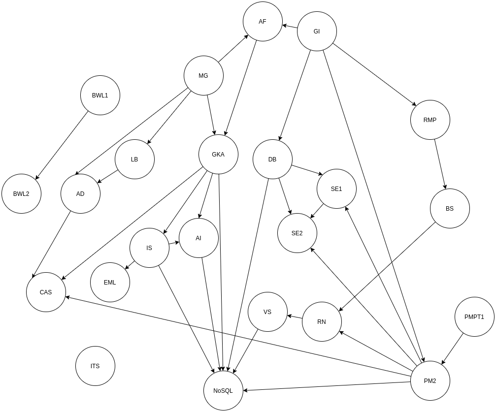

# NoSQL Praktikum Semester 6

## Aufgabe 1-3

Dokumentation siehe Ordner Aufg1

## Aufgabe 4

## to run the app

    cd Aufg2/node/
    docker run -d -p 6379:6379  --name my-redis redis
    node .
    docker exec -it my-redis redis-cli

Als struktur wurde eine Hashmap gewählt (hset).
Der Key ist dabei die PLZ (\_id) und die anderen Attribute die Values.
Durch diese Wahl kann nach der id gesucht werden und die zugehörige Stadt und der Staat angezeigt werden (Aufgabe a)

Für Aufgabe c wird ein weitere Index benötigt, der als Set (sadd) definiert ist und bei dem das Attribut "city" als Key verwendet wird.
Die PLZ (id) wird dabei als Value verwendet, was den Vorteil bietet, dass doppelte Einträge eleminiert werden.
Über smembers werden die zugehörigen Postleitzahlen in einem Array ausgegeben.

## Aufgabe 5

Folgender Graph wird in der Aufgabe umgesetzt:


Hierbei bedeuten die Kanten, dass die Informationen aus einem Kurs in dem anderen gebraucht werden.\

Um den Graphen in die Datenbank einzufügen wird ein Cypher [Skript](./Aufg2/cypher_code.cypher) verwendet.\
Im ersten Teil des Skriptes werden alle bisherigen besuchten Kurse als Knoten hinzugefügt.
Dies geschieht mit Hilfe folgender Notation:

```cypher
CREATE (x:Course {name: "X"})
```

Hierbei ist `x` die Variable, die in Cypher mit der Node belegt wird und `X` der Name des Kurses.
Um Relations zu definieren wird folgende Notation verwendet, wobei wir davon ausgehen, dass `a` und `b` Kurse sind und Kurs `b` Inhalte aus `a` verwendet:

```cypher
CREATE (a)-[:USED_IN]->(b)
```

Um auf die Daten zuzugreifen werden Cypher [Queries](./Aufg2/cypher_queries.cypher) verwendet.
Um herauszufinden, welche Module für NoSQL/BigData nützlich sind, haben wir folgende Query verwendet:

```cypher
MATCH (c1:Course)-[:USED_IN]->(c2:Course) WHERE c2.name = "NOSQL" RETURN c1
```

Um herauszufinden, welche Module bisher im Studium nicht wieder genutzt wurden haben wir folgende Queries verwendet:

```cypher
MATCH (c1:Course) WHERE NOT (c1)-[:USED_IN]->() RETURN c1
MATCH (c1:Course) WHERE NOT exists((c1)-[:USED_IN]->()) RETURN c1
```

Hierbei ist die zweite Query (laut des Neo4j-Browsers) anders als die erste nicht deprecated.

## Aufgabe 6

Daten [hier](http://nosqlzkn.ful.informatik.haw-hamburg.de/conceptnet.graph.db-v4.tar.gz)\
Daten in dem docker Container müssen zunächst entfernt werden.
Hierzu mit dem Befehl `docker exec -it neo4j-conceptnet /bin/bash` in den Container.
Dann mit dem Befehl `rm -rf /data/\*` alle Daten in data entfernen.
Die Daten werden mit dem Befehl `tar xf DATEI` entpackt.
Um die Daten zu importieren, müssen sie per `docker cp SOURCE_DIR CONTAINER_NAME:/data/` in die docker volume der neo4j Datenbank kopiert werden.
In dem Neo4j-Browser kann nun die entsprechende Datenbank ausgewählt werden. Eventuell muss der Docker-Container zunächst neu gestartet werden.\
Die Anfrage die gestellt werden muss ist:

```cypher
MATCH (n {id: "/c/en/baseball"})-[r:IsA]-(res) RETURN res
```

Das Ergebnis dieser ist [hier](./Aufg2/result_aufg6.txt) zu finden.

## Aufgabe 7

Redis LoC: 36
Mongo LoC: 25
Der Aufwand, um MongoDB in das besetehende Projekt einzubinden war sehr gering.
Zeitmessungen:

-   Befüllen:
    -   Redis: 0.19ms
    -   Mongo: 71.12ms
-   Query:
    -   Redis:
        -   PLZ: 0.147ms
        -   City: 0.149ms
    -   Mongo:
        -   PLZ: 1.028ms
        -   City: 2.648ms

## Aufgabe 8

a)
Einfügen der Dokumente mit Hilfe von Robo3t.\

```
db.fussball.insert({name: 'HSV', gruendung: new Date(1887, 09, 29), farben: ['weiss', 'rot'], Tabellenplatz: 17, nike: 'n'});
db.fussball.insert({name: 'Dortmund', gruendung: new Date(1909, 12, 19), farben: ['gelb', 'schwarz'], Tabellenplatz: 16, nike: 'n'});
db.fussball.insert({name: 'Schalke', gruendung: new Date(1904, 5, 4), farben: ['blau'], Tabellenplatz: 15, nike: 'n'});
db.fussball.insert({name: 'Paderborn', gruendung: new Date(1907, 8, 14), farben:['blau', 'weiss'], Tabellenplatz:14, nike:'n'});
db.fussball.insert({name: 'Hertha', gruendung: new Date(1892, 7, 25), farben: ['blau', 'weiss'], Tabellenplatz: 13, nike: 'j'});
db.fussball.insert({name: 'Augsburg', gruendung: new Date(1907, 8, 8), farben: ['rot', 'weiss'], Tabellenplatz: 12,  nike: 'j'});
db.fussball.insert({name: 'Pauli', gruendung: new Date(1910, 5, 15), farben: ['braun', 'weiss'], Tabellenplatz: 11, nike: 'n'});
db.fussball.insert({name: 'Gladbach', gruendung: new Date(1900, 8,1), farben: ['schwarz', 'weiss', 'gruen'], Tabellenplatz: 10, nike: 'n'});
db.fussball.insert({name: 'Frankfurt', gruendung: new Date(1899, 3, 8), farben: ['rot', 'schwarz', 'weiss'], Tabellenplatz: 9, nike: 'j'});
db.fussball.insert({name: 'Leverkusen', gruendung: new Date(1904, 11, 20), farben: ['rot', 'schwarz'], Tabellenplatz: 8, nike: 'n'});
db.fussball.insert({name: 'Stuttgart', gruendung: new Date(1893, 9, 9), farben: ['rot', 'weiss'], Tabellenplatz: 7, nike: 'n'});
db.fussball.insert({name: 'Werder', gruendung: new Date(1899,2,4), farben: ['gruen','weiss'], Tabellenplatz: 6, nike: 'j'});
```

b)
Lassen Sie sich nun die Vereine mit den jeweils folgenden Eigenschaften anzeigen:

1. mit Namen ‚Augsburg‘

```
db.getCollection('fussball').find({name: 'Augsburg'})
```

2. alle Nike-Vereine, welche schwarz als mindestens eine Vereinsfarbe haben

```
db.getCollection('fussball').find({nike: 'j', farben: 'schwarz'})
```

3. alle Nike-Vereine, welche weiss und grün als Vereinsfarbe haben

```
db.getCollection('fussball').find({nike: 'j', farben: {$all: ['weiss', 'gruen']}})
```

4. alle Nike-Vereine, welche weiss oder grün als Vereinsfarbe haben

```
db.getCollection('fussball').find({nike: 'j', farben: {$all: ['gruen']}, farben: {$all: ['weiss']}})
```

5. den Verein mit dem höchsten Tabellenplatz

```
db.fussball.find().sort({Tabellenplatz:+1}).limit(1)
```

6. alle Vereine, die nicht auf einem Abstiegsplatz stehen

```
db.fussball.find({Tabellenplatz: {$lt: 17}})
```

c)
Alle Nike vereine (\_id soll unterdrückt werden)

```
db.fussball.find({nike:'j'}, {'_id':false})
```

d)
Folgende Änderungsoperation wird ausgeführt:

```
db.fussball.update({name: 'Augsburg'}, {Tabellenplatz: 1})
```

Es ist zu beobachten, dass das Dokument komplett ersetzt wird. D.h. an Stelle des Ursprünglichen Augsburg Dokumentes ist nun ein Dokument, in dem nur der Tabellenplatz gelistet ist.
Um die Änderung rückgängig zu machen, wird folgender Befehl verwendet:

```
db.fussball.update({Tabellenplatz: 1}, {name: 'Augsburg', gruendung: new Date(1907, 8, 8), farben: ['rot', 'weiss'], Tabellenplatz: 12,  nike: 'j'});
```

e)

1. Ändern sie den Tabellenplatz von Leverkusen auf 2

```
db.fussball.update({name: 'Leverkusen'}, {$set: {Tabellenplatz: 2}})
```

2. Werder soll um einen Tabellenplatz nach vorne gebracht werden

```
db.fussball.update({name: 'Werder'}, {$inc: {Tabellenplatz: -1}})
```

3. Ergänzen sie für den HSV ein Attribut „abgestiegen“ mit einem sinnvollen Wert

```
db.fussball.update({name: 'HSV'}, {$set: {abgestiegen: 'niemals zweite Liiiigaaa ;)'}})
```

4. Ergänzen sie für alle Vereine, deren Vereinsfarbe weiss enthält, ein Attribut „Waschtemperatur“

```

db.fussball.updateMany({farben: {$all: ['weiss']}}, {$set: {Waschtemperatur: 90}})
```

## Aufgabe 9

Installieren von dem Cassandras

```
docker run --name our-cassandra -d cassandra:latest
```
## Aufgabe 11

Git Repo clonen mit `gcl git@github.com:big-data-europe/docker-hadoop.git`

Docker Image starten mit `docker-compose up`

Jar Datei erstellen, oder [diese](https://repo1.maven.org/maven2/org/apache/hadoop/hadoop-mapreduce-examples/2.7.1/hadoop-mapreduce-examples-2.7.1-sources.jar) herunterladen.

kopieren der Jar Datei in den Container `docker cp hadoop-mapreduce-examples-2.7.1-sources.jar namenode:/tmp/`

textdatei erstellen als `simple-text.txt`

Textdatei in den Container kopieren `docker cp simple-text.txt namenode:/tmp/`

Shell auf dem Namenode öffnen `docker exec -it namenode /bin/bash`

Input Directory erstellen `hdfs dfs -mkdir -p /user/root/input`

In den `tmp` ordner wechseln und die Textdatei in den `input` Ordner kopieren `hdfs dfs -put simple-text.txt /user/root/input`

den Map Reduce Job ausführen `hadoop jar hadoop-mapreduce-examples-2.7.1-sources.jar org.apache.hadoop.examples.WordCount input output`

    - org.apache.hadoop.examples is the class.
    - WordCount is the function.
    - input is the directory where we have our file.
    - output where the files will be generated.
    
Testen, ob es erfolgreich war `hdfs dfs -ls /user/root/output`

Das Ergebnis anzeigen `hdfs dfs -cat /user/root/output/part-r-00000`
